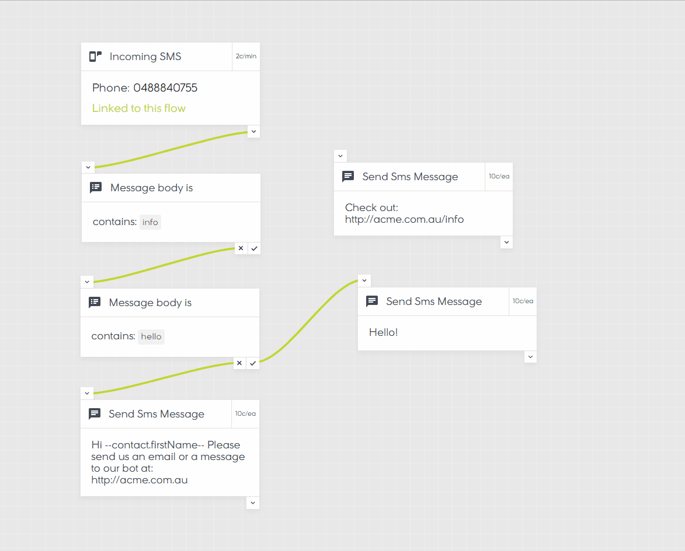

# React Flow Chart

## WORK IN PROGRESS

### [Demo](https://mrblenny.github.io/react-flow-chart/index.html?selectedKind=With%20Sidebar&selectedStory=default&full=0&addons=1&stories=1&panelRight=0&addonPanel=storybook-addon-viewport%2Faddon-panel)

This project aims to build a highly customisable, declarative flow chart library. Critically, your control the state. Pick from Redux, MobX, React or any other state managment library - simply pass in the current state and hook up the callbacks.

For example:



## Data Stucture

The flow chart is designed as a collection of Nodes, Ports and Links. You can specify your own custom properties, making this format quite flexible. See [types/chart.ts](https://github.com/MrBlenny/react-flow-chart/blob/master/src/types/chart.ts). Note, nodes, ports and links should have a unique id.

Example

```ts

export const chart: IChart = {
  offset: {
    x: 0,
    y: 0,
  },
  nodes: {
    node1: {
      id: 'node1',
      type: 'output-only',
      position: {
        x: 300,
        y: 100,
      },
      ports: {
        port1: {
          id: 'port1',
          type: 'output',
          properties: {
            value: 'yes',
          },
        },
        port2: {
          id: 'port2',
          type: 'output',
          properties: {
            value: 'no',
          },
        },
      },
    },
    node2: {
      id: 'node2',
      type: 'input-output',
      position: {
        x: 300,
        y: 300,
      },
      ports: {
        port1: {
          id: 'port1',
          type: 'input',
        },
        port2: {
          id: 'port2',
          type: 'output',
        },
      },
    },
  },
  links: {
    link1: {
      id: 'link1',
      from: {
        nodeId: 'node1',
        portId: 'port2',
      },
      to: {
        nodeId: 'node2',
        portId: 'port1',
      },
    },
  },
  selected: {},
  hovered: {},
}

```

## Contributing

If you're interested in helping out, let me know. 

In particular, would be great to get a hand with docs and redux / mobx integrations.

## Install

Probably best not to use npm at this point. Things will be changing wildly.

```bash
npm i @mrblenny/react-flow-chart
```

## Development

```bash
npm install
npm run start:storybook
```
